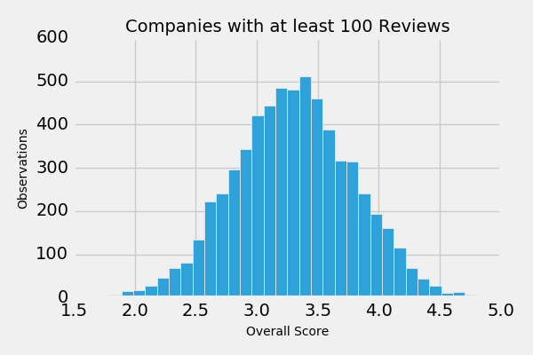

#Capstone Project: Analyzing Employer Trends
___
### Overview:
- Collect employee review data from Glassdoor to understand trends in the workplace. What makes Google such a great place to work?
- Using Natural Language Processing, I will analyze a corpus of documents gathered from scraping Glassdoor's employer pages, business articles, and other miscellaneous sources to discover trends in companies typically though of as "best to work for".

#### *Gathering Data:*
In order to choose which employers to focus on for this analysis, I utilized Glassdoor's Employers API to pull all the employers in their database. In order to gather a large enough corpus of reviews, I chose to focus on companies with at least 100 reviews.

Since the goal of this project is to identify trends in what makes an employer especially great (or not so great), I chose to focus even further on companies with a score either below the 5th percentile or above the 95th percentile.

