# Quantifying Employee Satisfaction

#### Data Science Immersive Capstone Project - Powered By:

  

___
## Overview
The goal of this project is to analyze topics in Glassdoor's employee reviews, in order to understand what employees like and dislike about their employers. To answer this question, I will need to accomplish a few things:
- Identify employers that have significantly high and low scores, and that have enough reviews to collect a large corpus.
- Collect employee review data for each of the employers that I have identified as a target for analysis.
- Analyze a corpus of employee feedback using Natural Language Processing techniques. Identify latent topics and their relative importances using Non-Negative Matrix Factorization.

***Want to skip the minutia?*** [Click here!](#results)
## Gathering Data
In order to choose which employers to focus on for this analysis, I utilized the Glassdoor Employers API to query all the employers in their database. Here's a quick look at the raw scores for the 560,000+ employers in Glassdoor's database:

  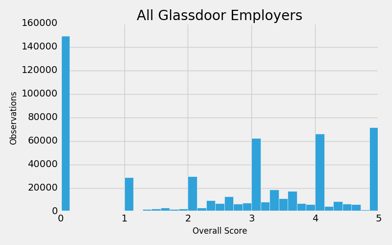

In order to normalize the scores and gather a large enough corpus of reviews, I chose to focus on employers with at least 100 reviews.

  

Since the goal of this project is to identify trends in what makes an employer especially great (or not so great), I chose to focus even further on companies with a score either below the 5th percentile or above the 95th percentile.

  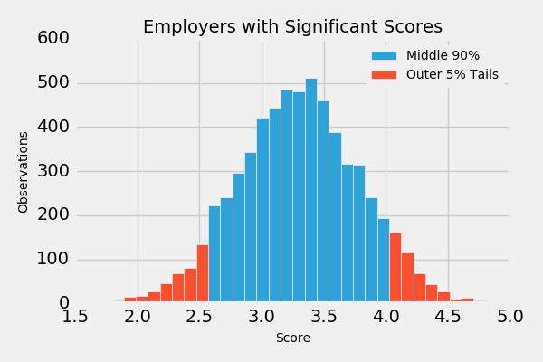

___
## Creating a Corpus
Once I identified which employers were good candidates for analysis, I needed to gather all the reviews for each company. Specifically, the "Pros" for each highly rated company as well as the "Cons" for each poorly rated company. Since Glassdoor does not have an API through which I could download reviews, it became a web scraping problem.

#### Web Scraping
For my web scraper, the primary packages that I utilized were `BeautifulSoup` and `selenium`. Since users are required to provide credentials to access all of Glassdoor's reviews, I used selenium to navigate to the login page and enter a set of credentials before scraping any reviews. I also took advantage of multithreading for boosting performance. This allowed multiple browsers to run at once and load multiple pages simultaneously. I also split the workload manually between several machines. More on this in the `Challenges` section later.

#### Scrubbing the Data
In any Natural Language Processing analysis, cleaning up the raw data is essential to glean any meaning from the text. Without preprocessing the text, much of our analysis would be centered around different forms of the same word as well as articles and conjunctions. To get the text into its purest form for analysis, I took several steps.

##### *Stop Words*
The first step in cleaning up the corpus is removing [stop words](https://en.wikipedia.org/wiki/Stop_words). In a nutshell, stop words are common words that help to create sentence structure, but do not add any meaning to the idea that a sentence is trying to convey. For example, stop words in the sentence preceding this one would be:

- Stop words: *In, a, are, that, to, but, do, any, to, the, that, a, is, to*
- Meaningful words: *nutshell, stop, words, common, words, help, create, sentence, structure, not, add, meaning, idea, sentence, trying, convey*

You may notice that a few words are repeated in the above summary. This is important for our TF-IDF matrix (discussed later) which will help us to cluster different topics and the most frequent words within each topic.

##### *Stemming/Lemmatization*
After removing stop words from the corpus, the next step is [stemming](https://en.wikipedia.org/wiki/Stemming) or [lemmatizing](https://en.wikipedia.org/wiki/Lemmatisation) the text. Stemming involves removing endings from words to reduce each word to its stem (i.e. "working" is reduced to "work"). Lemmatization goes a step further, and reduces each word to its morphological root, or `lemma`, taking tense and other linguistic nuance into account (i.e. "is", "am", "are" become "be"). Lemmatization can be computationally more expensive, but it typically yields better results. I implemented a lemmatization algorithm using [spaCy](https://spacy.io) for this project.

##### *Part of Speech Tagging*
Part of speech tagging is another important step in Natural Language Processing. It allows for the inclusion or exclusion of certain parts of speech (e.g. articles, conjunctions) if they are not excluded in the removal of stop words. Part of speech tagging also helps in lemmatizing the corpus. Many words can be more than one part of speech. For example, take the word `work`. As a noun, "I have work to do." As a verb, "I work for Galvanize."

##### *N-grams*
One last step in successfully capturing ideas from the corpus of text is allowing for [n-grams](https://en.wikipedia.org/wiki/N-gram). N-grams are essentially sequential groups of words that communicate a different idea together than they do apart. A good example of an n-gram is `New England Patriots`. Together, the three words clearly allude to the NFL team. Apart, the words `New`, `England`, and `Patriots` communicate their own distinct ideas. In the context of this project, I did not discover any n-grams that were prevalent across the corpus.

___
## Analyzing the Corpus

#### TF-IDF Matrix
This is where the fun starts. How can we quantify and cluster topics when we only have text data? We can begin by creating a [Term Frequency](https://en.wikipedia.org/wiki/Document-term_matrix) matrix. In this approach, Each document (for this project, each review) is a row in our matrix, and each column represents the count of a word in each document. This approach is only limited by the potential difference in document length. If one user writes a review that is 400 words long and another writes a review that is 20 words long, the term frequency weights can be easily skewed by the longer article.

This problem is offset by the [Inverse Document Frequency](https://en.wikipedia.org/wiki/Tf%E2%80%93idf). Each value in our Term Frequency matrix is multiplied by its corresponding Inverse Document Frequency. The Inverse Document Frequency is a statistic that is calculated by taking the total number of documents in the corpus and dividing by the number of documents which contain that particular word, then taking the logarithm of the result. This serves to weight each word by how much information it provides. In a less mathematical sense, the more documents in which a word appears in the corpus, the less important that word will be in our analysis.

  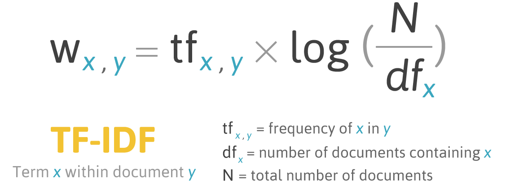

#### Topic Modeling with NMF
I wanted to identify latent topics present in the reviews that I collected. To do this, it was important to separate the corpus into a positive corpus and a negative corpus. This was simple to do since I had labeled the data while collecting it. Once the text was separated, I clustered the reviews into topics based on latent features contained in each review.

The clustering algorithm I chose for this corpus was [Non-Negative Matrix Factorization](https://en.wikipedia.org/wiki/Non-negative_matrix_factorization). NMF decomposes the TF-IDF matrix into two matrices to allow us to identify latent topics present in each document. Using this algorithm allows us to see multiple latent topics in each document, as opposed to other methods of clustering which would assign a document to one and only one cluster. For this corpus, I allowed each document to cluster with any topic for which the attributability was 20%. I experimented with different numbers of topics for each corpus, and the best results came from using 25 topics for positive reviews and 10 topics for negative reviews.

  

## Results

## Top 3 Positive Results by Number of Reviews

  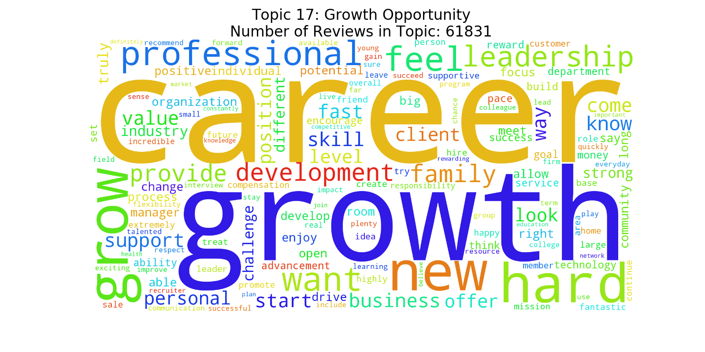
  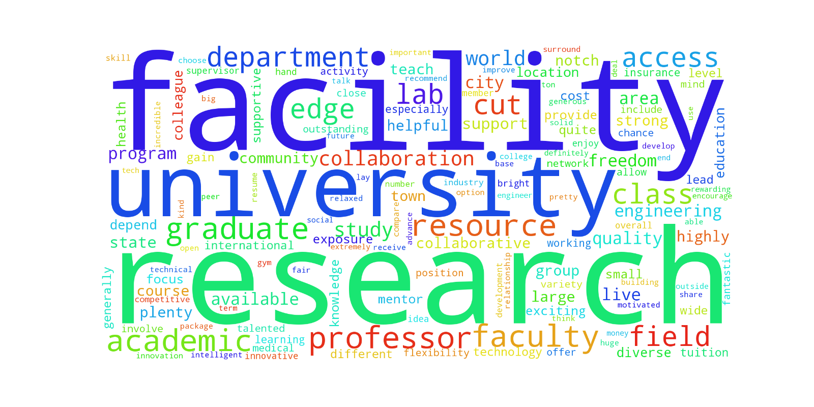
  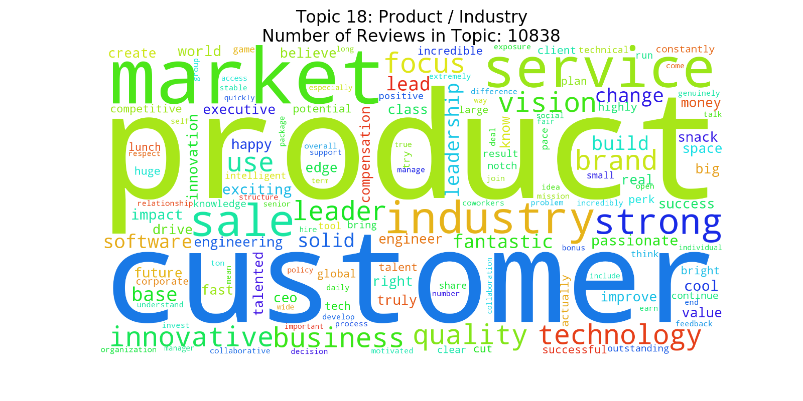

## Top 3 Negative Results by Number of Reviews

  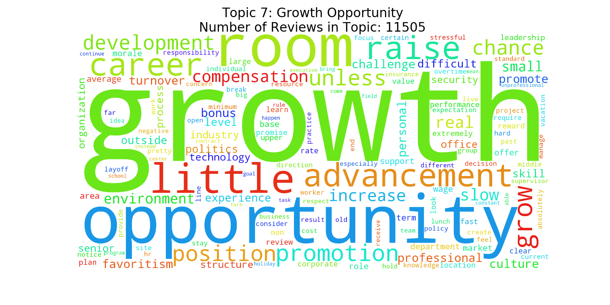
  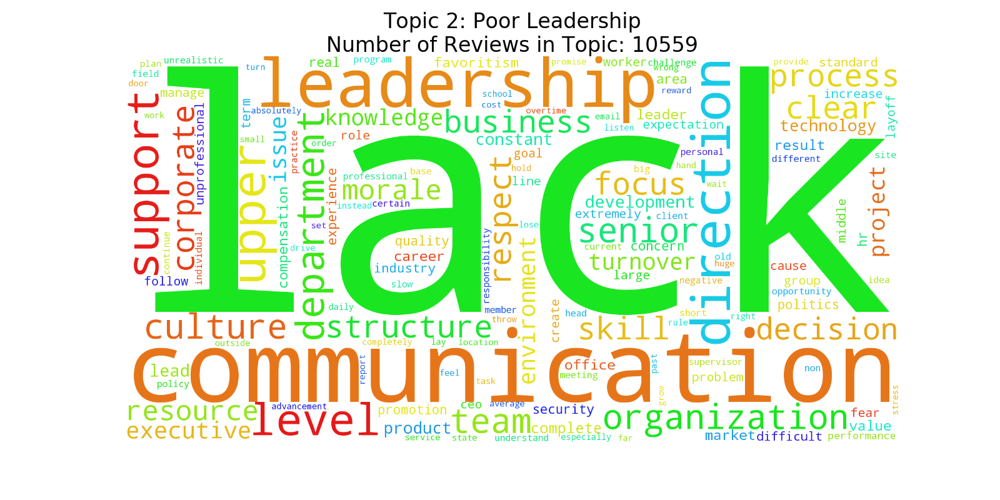
  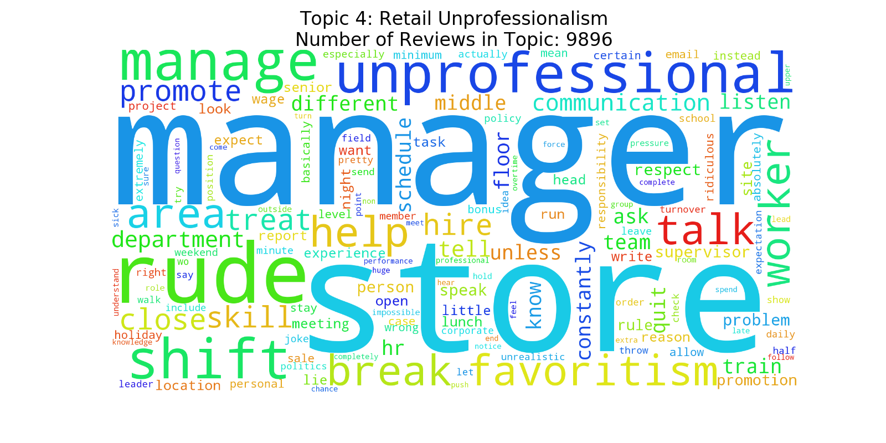

## Topics in Both Positive & Negative Feedback:

                Positive                 |                 Negative       
:---------------------------------------:|:------------------------------------:
| 
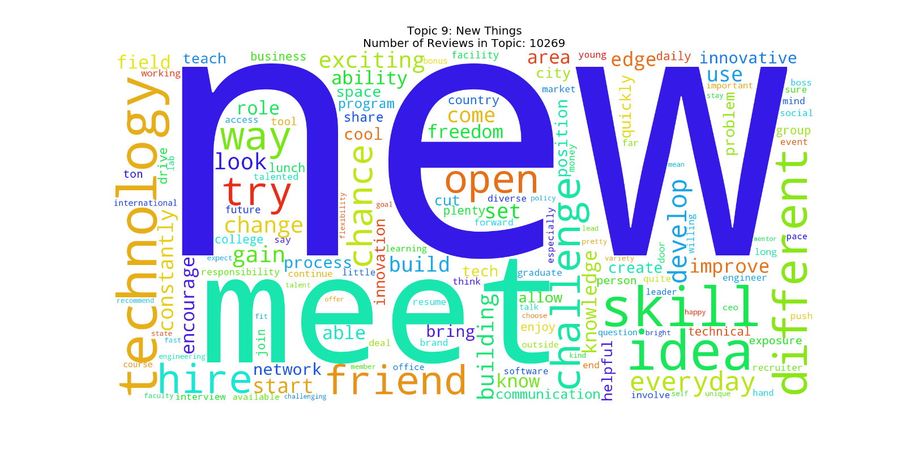 | 
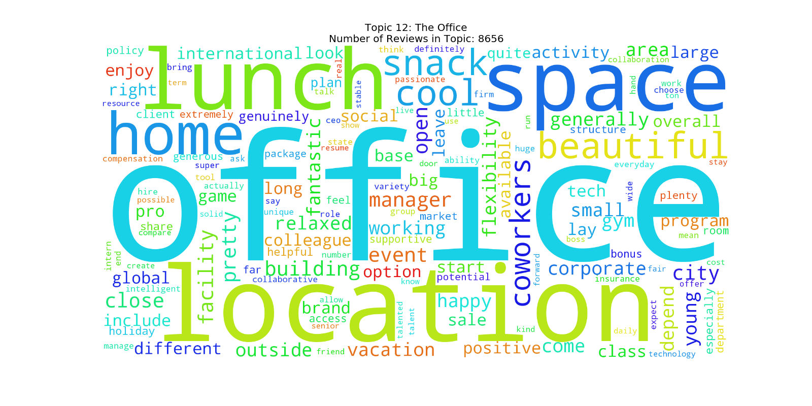| 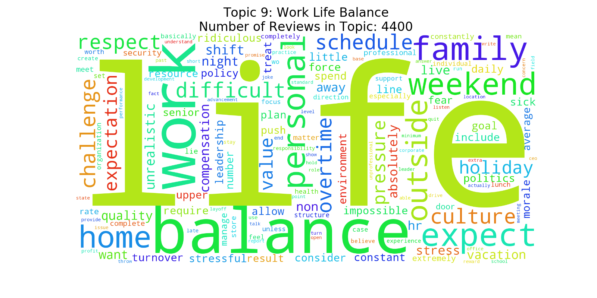
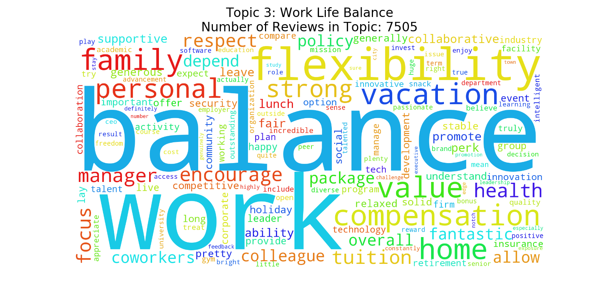 | 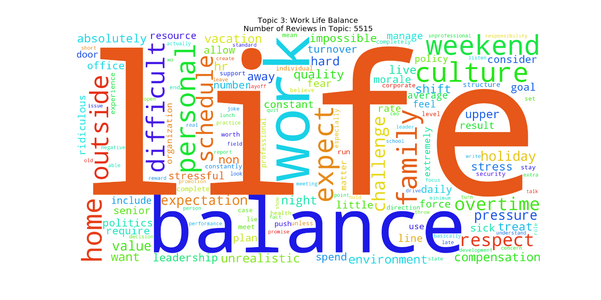
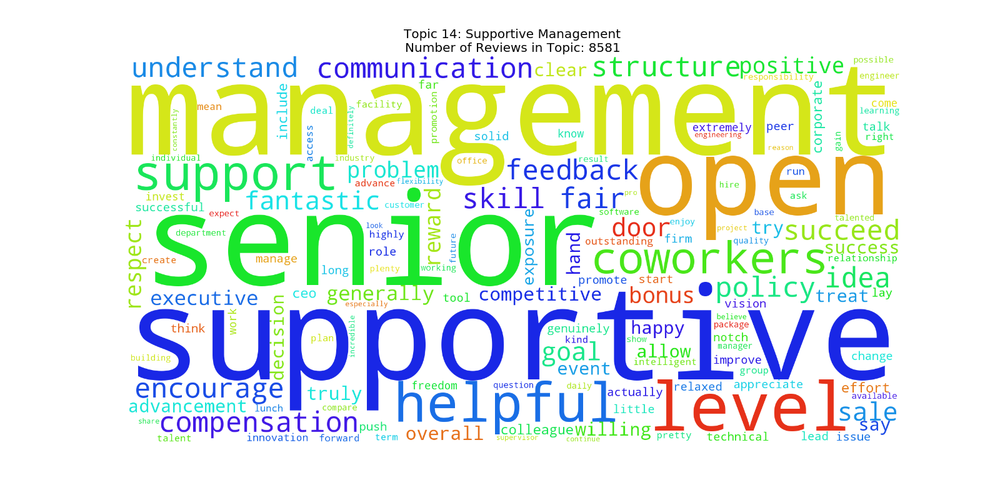| 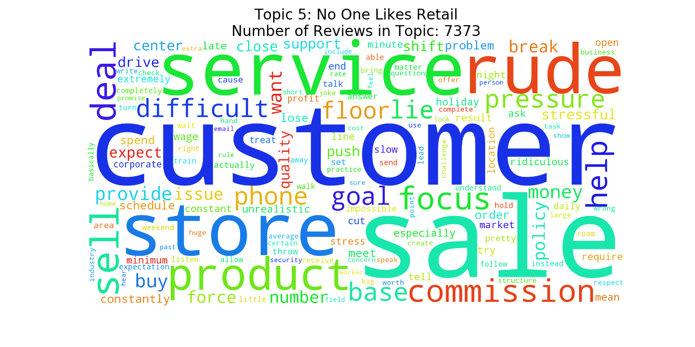

___
## Challenges
The biggest overall challenge in this project was by far the data collection. Glassdoor is quite sophisticated in their bot detection, which makes it difficult to do any sort of scraping on their site. I ran into roadblocks in both phases of my data collection.

##### *API for Employer Data*
While utilizing the Glassdoor API in the first phase, I ran into 2 main problems while downloading employer data.
- The first was being immediately blocked for having no user-agent in the header associated with my url requests. After I gave my requests a header with a Mozilla user-agent, I was able to begin downloading employer data.
- After fixing the header issue, I ran into a few more HTTP 403 errors, but I was able to bypass these by sending another request for the same page after a short timeout.

##### *Scraping Review Text*
Building a scraper to parse through each page for each employer and grab the relevant information was relatively straightforward; however, I did run into one major roadblock:

   
  <b>THE DREADED CAPTCHA</b>

- I attempted many workarounds to allow me to automatically solve CAPTCHA images, but to no avail. The most promising package out there is [tesseract](https://github.com/tesseract-ocr/tesseract) and its python integration `pytesseract`. Given more time to work on this project, I would spend more time training tesseract to solve this problem.

- The solution I implemented was a pause in my scraper that would wait for me to manually solve the captcha in the selenium browsers, and once I had done that, resume the scrape. Since I only encountered these challenge images every 10 minutes or so, it made sense just to babysit the process until I had collected all the data I needed.

##### *Volume of Data*
The final challenge to gathering as many reviews as I wanted was the sheer volume of data that I collected. In order to get all the reviews for all the employers that I wanted to analyze, I had to distribute the workload between five computers. After splitting the data into manageable chunks, each machine ran the threaded scraper for about 10 hours.

<b>NOTE:</b> Data is available in pickle format upon <a href="mailto:thedavehogue@gmail.com">request</a>, if you are so inclined as to run any of these scripts yourself.

## Technologies Used

I used the following list of python packages, along with several other built-in libraries, in this Natural Language Processing project.
- [Scikit-learn](http://scikit-learn.org/stable/)
- [spaCy](https://spacy.io)
- [Selenium](http://docs.seleniumhq.org/)
- [requests](http://docs.python-requests.org/en/master/)
- [BeautifulSoup](https://www.crummy.com/software/BeautifulSoup/bs4/doc/)
- [pymongo](https://api.mongodb.com/python/current/)
- [matplotlib](http://matplotlib.org/)
- [wordcloud](https://pypi.python.org/pypi/wordcloud)
- [multiprocessing](https://docs.python.org/2/library/multiprocessing.html)
- [threading](https://docs.python.org/2/library/threading.html#module-threading)
- [pandas](http://pandas.pydata.org/pandas-docs/stable/)
- [NumPy](http://www.numpy.org/)
- [cPickle](https://pymotw.com/2/pickle/)

## Acknowledgements

Special thanks to the following people for their help with this project:

<b>Erich Wellinger</b> - for his stellar instruction on NLP and other special topics throughout the Data Science Immersive course.

<b>Juno Lee</b> - for help managing my scrapers that collected all of the text for this project.
